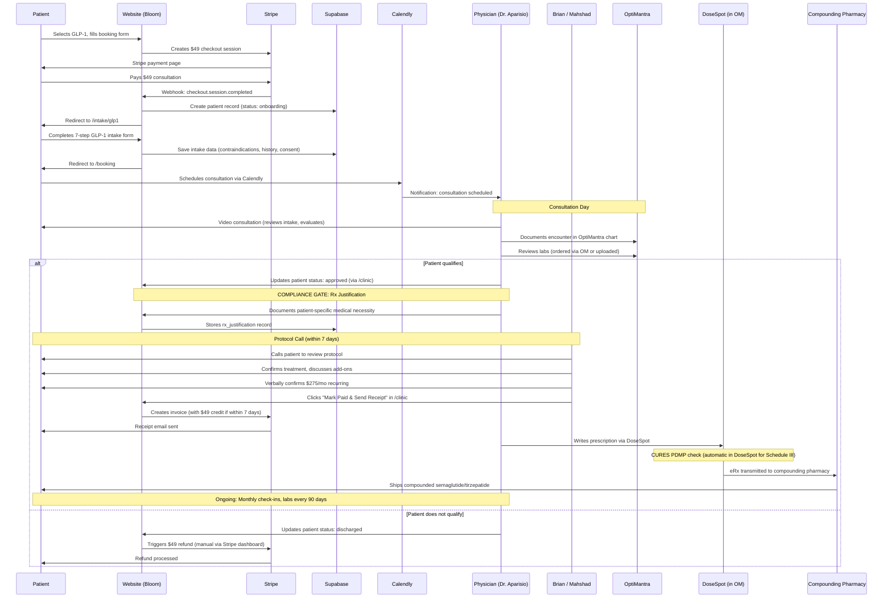

# Deliverable 3: Architecture Confirmation

## Application Architecture

Single Next.js 14 App Router application deployed on Vercel (iad1 region). Route segmentation:
- `/` — public marketing pages (no auth)
- `/intake/*` — patient intake forms (session-gated via Stripe session ID)
- `/clinic/*` — provider dashboard (Supabase Auth, client-side enforcement)
- `/api/*` — server-side API routes (mixed auth: some Bearer, some none)

### Middleware

**File:** middleware.ts (141 lines)

The middleware applies to ALL requests and handles:
1. Security headers (CSP, HSTS, X-Frame-Options, etc.) — GOOD
2. Rate limiting on /api/auth and /login (20 req/60s/IP, in-memory) — FUNCTIONAL but ephemeral
3. Session validation for protected routes

**CRITICAL GAP:** The protected routes list (lines 6-17) references OLD Nova Health routes that don't exist in this codebase:
```
/dashboard, /clients, /compliance, /documents, /messaging, /settings
```
The ACTUAL clinic routes (`/clinic/*`, `/api/clinic/*`) are NOT in the middleware protected list. Auth for clinic is enforced entirely client-side in app/clinic/layout.tsx. This means `/api/clinic/patients`, `/api/clinic/billing`, `/api/clinic/ehr` are accessible to any HTTP client without authentication.

**Recommendation:** Add `/clinic/*` and `/api/clinic/*` to the middleware protected routes list. Enforce Supabase session validation server-side before any clinic API route executes.

## Auth Strategy

### Current Implementation

| Layer | Provider | Method | MFA | Roles |
|-------|----------|--------|-----|-------|
| Patient | None | Session ID from Stripe | No | No roles |
| Provider (clinic) | Supabase Auth | Email + Password | No | Via user_metadata |
| Agent API | Bearer token | NOVA_AGENT_API_KEY or sk-ant-* prefix | No | No roles |

### Roles Defined

In lib/clinic/types.ts:
```typescript
type UserRole = 'super_admin' | 'physician' | 'clinician' | 'rn_ma' | 'admin_ops'
```

In app/clinic/layout.tsx (line 15):
```typescript
const ALLOWED_ROLES = ['super_admin', 'physician', 'clinician', 'rn_ma', 'admin_ops']
```

**Current team (hardcoded in settings/agents):**
- Brian DeGuzman — super_admin (Founder & RN)
- Albert Aparisio — physician (Medical Director)
- Mahshad Nejad — admin_ops (Patient Coordinator / Operations)

### Recommendations

1. **Add MFA** — Required for HIPAA. Use Supabase Auth TOTP (authenticator app). Enforce on all provider accounts.
2. **Server-side role enforcement** — Add role check middleware for /api/clinic/* routes. Physicians can do everything; RN/admin_ops restricted from modifying prescriptions/protocols.
3. **Session timeout** — Add 15-minute idle timeout. Currently sessions persist indefinitely.
4. **Patient role** — No patient auth exists. Patients interact via session-gated intake forms and Calendly. No patient portal.

## Patient Self-Service Scope

**Does /portal exist?** No.

**Current patient touchpoints:**
1. /book — booking form + Stripe checkout (no auth)
2. /intake/trt or /intake/glp1 — intake form (session ID gate, no auth)
3. /booking — Calendly embed (session ID gate)
4. Stripe — receives invoices/receipts via email
5. Email — brian@bloommetabolics.com for direct communication

**Recommendation:** Do NOT build /portal/* for launch. OptiMantra has a built-in patient portal for:
- Viewing appointment history
- Accessing lab results
- Messaging provider
- Viewing prescriptions

Building a minimal Bloom patient portal would duplicate OptiMantra's patient portal and create a confusing dual-portal experience.

**If minimal self-service is desired post-launch, scope to:**
- /portal/consents — view/sign informed consents
- /portal/preferences — communication preferences (email, SMS opt-in/out)
- /portal/documents — download intake form, consent copies

**Document boundary:** `/compliance/patient-portal-scope.md`

## Clinician Interface Scope

### Existing /clinic/* Routes

| Route | Purpose | Status |
|-------|---------|--------|
| /clinic | Command center (KPIs, alerts, tasks) | Live — Supabase data |
| /clinic/patients | Patient roster with treatment type tabs | Live — Supabase data |
| /clinic/patients/[id] | Patient profile (intake, billing, labs, vitals) | Live — Supabase data |
| /clinic/alerts | Clinical alerts | Live — empty (no seed data) |
| /clinic/tasks | Task management | Live — empty |
| /clinic/settings | Team, MCP, notifications, security | Live — hardcoded team |
| /clinic/login | Supabase auth login | Live |

### Compliance Gates Needed (New Routes)

| Route | Purpose | Issue # |
|-------|---------|---------|
| /clinic/rx-justification | Compounded GLP-1 medical necessity documentation | #4 |
| /clinic/cures | CURES PDMP attestation before TRT prescription | #10 |
| /clinic/consents | Patient consent management + document generation | #9 |
| /clinic/audit-log | Audit log review interface | #8 |
| /clinic/credentials | Provider credential management (licenses, NPI, board certs) | #14 |

## Single Source of Truth Table

| Data Type | Source of Truth | Referenced By | Notes |
|-----------|----------------|---------------|-------|
| Patient demographics | OptiMantra (target) / Supabase (current) | Clinic dashboard, intake forms | Currently Supabase patients table. Should migrate to OptiMantra as SoT with Supabase as cache. |
| Prescriptions | OptiMantra + DoseSpot | Clinic dashboard (future) | Not yet in Bloom system. DoseSpot handles eRx within OptiMantra. |
| Lab results | OptiMantra (ordered) / Lab vendor (resulted) | Clinic dashboard | Currently Supabase lab_results table. Should pull from OptiMantra. |
| Appointments | Calendly (scheduling) / OptiMantra (clinical record) | /booking page, clinic dashboard | Calendly for scheduling; OptiMantra for visit documentation. |
| Charts / encounter notes | OptiMantra | Not yet referenced | Bloom has encounters table but it's empty. OptiMantra is where charting happens. |
| Informed consents | Supabase intake_submissions | Clinic dashboard patient profile | Consent data captured in intake wizard, stored in Supabase. Should sync to OptiMantra. |
| Rx justifications | Does not exist | N/A | Must be NET-NEW. Source of truth: Supabase (compliance-specific data). Sync to OptiMantra chart. |
| CURES attestations | Does not exist | N/A | Must be NET-NEW. Source of truth: Supabase. Documentation that prescriber checked CURES before writing TRT. |
| Audit logs | Supabase audit_logs table (schema exists) / In-memory (runtime) | /clinic/audit-log (doesn't exist yet) | In-memory runtime logging is NOT persistent. Needs migration to Supabase writes. |
| Payment records | Stripe | Clinic dashboard billing panel, Supabase (customer ID reference) | Stripe is SoT for all payment/subscription data. Supabase stores stripe_customer_id link. |
| Marketing leads | Supabase leads table + GHL CRM | /api/leads route | Dual-write: Supabase AND GHL. GHL is operational CRM for nurture sequences. |
| Communication preferences | Does not exist | N/A | Must be NET-NEW. Required for TCPA compliance. Supabase table: communication_consents. |

## Clinician Workflow Narrative

### Compounded GLP-1 Prescription Flow



### Where Prescriber Lives vs Where Compliance Gates Live

| System | What Happens There |
|--------|-------------------|
| **OptiMantra** | Patient chart, encounter documentation, lab ordering/review, DoseSpot eRx, CURES (via DoseSpot), appointment management |
| **Bloom /clinic** | Intake form review, billing/subscription management, Rx justification documentation, CURES attestation confirmation, task management, alert monitoring, EHR sync status |
| **Stripe** | Payment processing, subscription management, invoicing, receipts |
| **Calendly** | Appointment scheduling (embeds in Bloom) |
| **GHL CRM** | Lead nurture sequences, marketing automation |

The prescriber's primary workspace is OptiMantra. Bloom /clinic is the compliance and operations layer — it handles what OptiMantra doesn't: intake form review, Rx justification for compounded meds, billing workflow with verbal confirmation, and operational task management.
