# Attachment A — SOP Lifecycle Flowchart

**Parent Document:** [SOP-001 — Document Control & SOP Lifecycle Management](../SOP-001-document-control.md)

---

## Lifecycle State Diagram

```mermaid
stateDiagram-v2
    [*] --> Draft : SOP initiated

    Draft --> UnderReview : Owner submits for review
    UnderReview --> Draft : Feedback requires rework
    UnderReview --> Approved : All reviews complete;\nsignatures obtained

    Approved --> Active : Effective date reached;\noperationalization verified

    Active --> Active : Annual review — no change
    Active --> MinorRevision : Annual review — minor update needed
    Active --> MajorRevision : Annual review — substantive change needed
    Active --> MajorRevision : Accelerated trigger (regulatory change,\nadverse event, guideline update)

    MinorRevision --> Active : Owner approves;\nversion increments minor digit

    MajorRevision --> Draft : New version drafted;\nprevious version pending supersession

    Active --> Superseded : New version activated
    Active --> Retired : Activity permanently discontinued

    Superseded --> [*]
    Retired --> [*]

    state Active {
        direction LR
        [*] --> Operating
        Operating --> ReviewDue : Next review date reached
        ReviewDue --> Operating : Review completed
    }
```

---

## State Transition Summary

| From | To | Trigger | Authorization |
| --- | --- | --- | --- |
| — | Draft | SOP initiated | Document Owner |
| Draft | Under Review | Owner certifies structural completeness | Document Owner |
| Under Review | Draft | Reviewer returns with required rework | Reviewer |
| Under Review | Approved | All reviews complete; signatures obtained | Approving Authority |
| Approved | Active | Effective date reached; operationalization verified | Document Owner |
| Active | Active (renewed) | Annual review — no change | Document Owner |
| Active | Minor Revision | Non-substantive update identified | Document Owner |
| Minor Revision | Active | Owner approves minor change | Document Owner |
| Active | Major Revision | Substantive change required | Document Owner + Approving Authority |
| Major Revision | Draft (new version) | New version initiated | Document Owner |
| Active | Superseded | New version activated | Automatic |
| Active | Retired | Activity discontinued | Document Owner + Approving Authority |

---

## Terminal States

- **Superseded:** Document replaced by a newer version. Archived permanently. Never deleted.
- **Retired:** Activity no longer performed. Archived permanently. Never deleted.

Both terminal states preserve the document for the full regulatory retention period (minimum six years per HIPAA; indefinite for audit trail purposes).

---

*Bloom Metabolics — Confidential*
